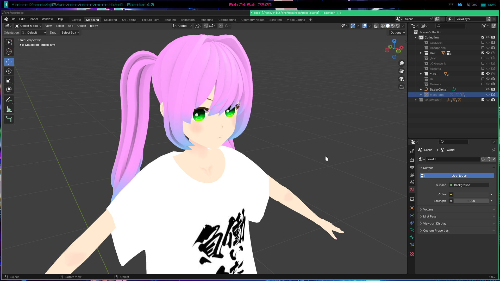
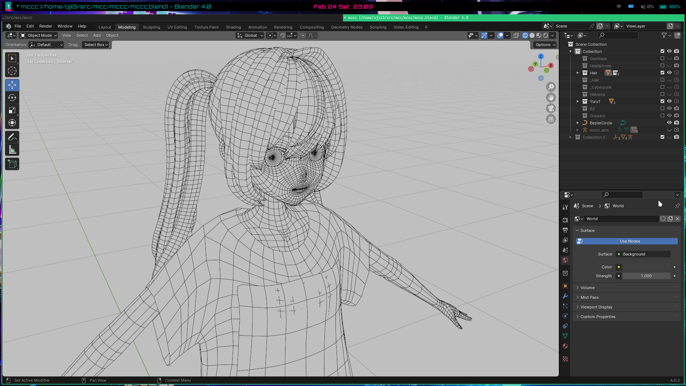

# MCCC

Original 3D Character Created from Scratch in Blender

## Tools

- Blender 4.*
- Krita (Texture Painting)
- Unity (Shader and Animation Testing)
  - [tuatmcc/MCCC4Unity](https://github.com/tuatmcc/MCCC4Unity)

## Environment

All tools above are cross-platform and can be used on Windows, macOS, and Linux (I use Arch btw).

## Preview (2024-02-24)

### Texture

### Wireframe

